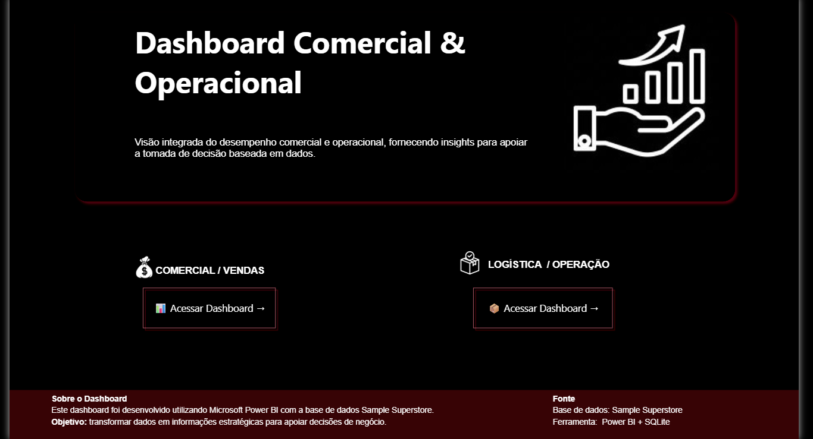
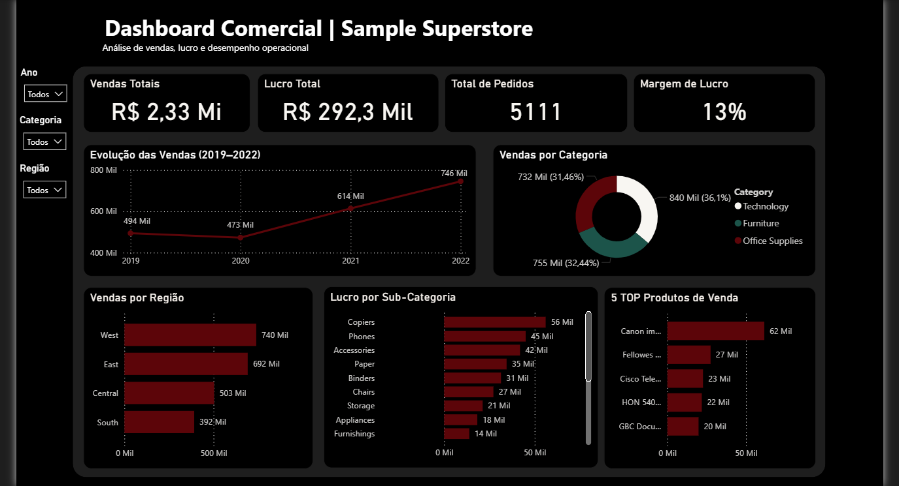
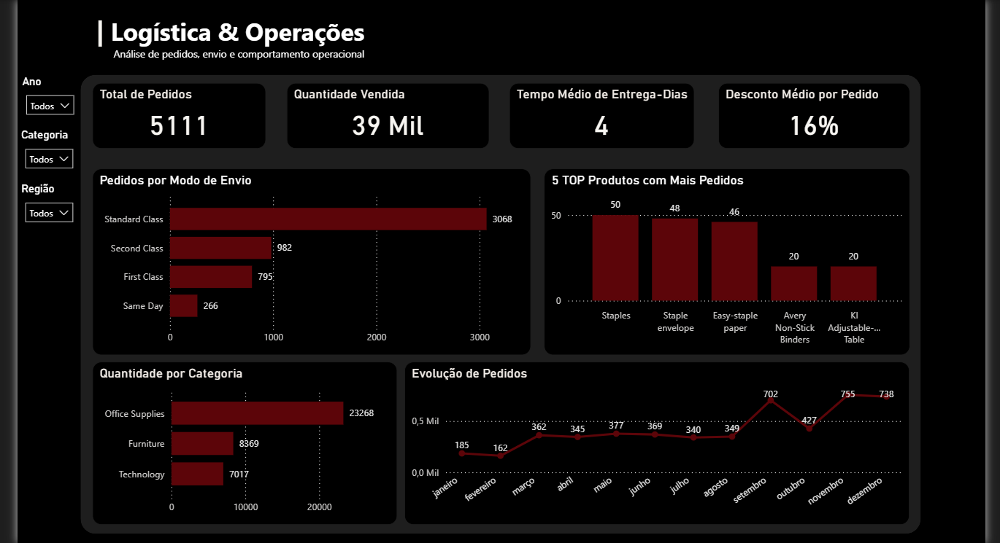

# 📊 Sample Superstore Sales Analysis

## 📌 Sobre o Projeto

Este projeto foi desenvolvido com o objetivo de analisar o desempenho comercial e operacional da base de dados **Sample Superstore**.

Foram utilizadas consultas em **SQLite/SQL** para exploração dos dados e o **Power BI** para criação de dashboards interativos, transformando dados de vendas, lucro, clientes, produtos e logística em informações estratégicas para apoio à tomada de decisão.

O projeto simula um cenário real de análise de dados, envolvendo tratamento, exploração, criação de indicadores e visualização de resultados.

---

# 🎯 Objetivos

- Analisar desempenho de vendas e lucratividade.
- Identificar categorias e produtos com melhor desempenho.
- Avaliar resultados por região.
- Analisar indicadores operacionais relacionados aos pedidos.
- Desenvolver um dashboard executivo para acompanhamento dos resultados.

---

# 🛠️ Ferramentas Utilizadas

- Power BI
- SQL
- SQLite
- Visual Studio Code

---

# 📂 Estrutura do Projeto

```text
Sample-Superstore-Sales-Analysis/

├── data/
│   └── Sample_Superstore.csv
│
├── database/
│   └── superstore.db
│
├── images/
│   ├── home.png
│   ├── comercial.png
│   └── logistica.png
│
├── powerbi/
│   └── Dashboard_Comercial_Operacional.pbix
│
├── sql/
│   └── 01_analise_comercial_operacional.sql
│
└── README.md
```

---

# 📊 Dashboard Power BI

O dashboard foi desenvolvido com três páginas principais:

## 🏠 Home

Página inicial com visão geral do projeto e navegação.



---

## 💰 Comercial

Análise dos principais indicadores:

- Total de vendas
- Lucro
- Pedidos
- Margem de lucro
- Categorias
- Regiões
- Produtos
- Clientes



---

## 🚚 Logística e Operações

Análises relacionadas a:

- Modos de envio
- Quantidade vendida
- Pedidos
- Desempenho operacional



---

# 🔎 Análises Desenvolvidas em SQL

## Exploração da Base

- Visualização inicial dos dados
- Quantidade total de registros
- Análise da estrutura dos dados

## Análise Comercial

- Total de vendas
- Total de lucro
- Total de pedidos
- Quantidade vendida
- Vendas por categoria
- Lucro por categoria
- Vendas por região
- Lucro por região
- Top produtos por vendas
- Top clientes por vendas

## Análise Operacional

- Pedidos por modo de envio
- Quantidade vendida por categoria
- Produtos com maior volume
- Desconto médio por categoria

## Análise Temporal

- Evolução das vendas por ano
- Evolução do lucro por ano

## Análise de Rentabilidade

- Margem de lucro por categoria
- Margem de lucro por região

---

# 💡 Principais Insights

- Identificação das categorias com maior impacto em vendas e lucro.
- Análise das regiões com melhor desempenho comercial.
- Identificação dos produtos e clientes mais relevantes para o negócio.
- Comparação entre volume de vendas e rentabilidade.
- Avaliação dos indicadores operacionais relacionados aos pedidos.

---

# 📈 Principais Indicadores

- Total de Vendas
- Lucro Total
- Total de Pedidos
- Margem de Lucro
- Quantidade Vendida
- Vendas por Categoria
- Lucro por Região
- Top Produtos
- Top Clientes

---

# 📚 Habilidades Demonstradas

- Escrita de consultas SQL.
- Funções de agregação.
- Agrupamentos e ordenações.
- Análise exploratória de dados.
- Modelagem de dados.
- Criação de dashboards no Power BI.
- Visualização de indicadores.
- Organização e documentação de projetos.

---

# 🚀 Próximos Passos

Como evolução deste projeto, pretendo ampliar meus conhecimentos em:

- SQL Avançado.
- Python para Análise de Dados.
- Excel Avançado.
- Estatística aplicada à análise de dados.

---

Projeto desenvolvido para fins de estudo e construção de portfólio na área de Análise de Dados.
